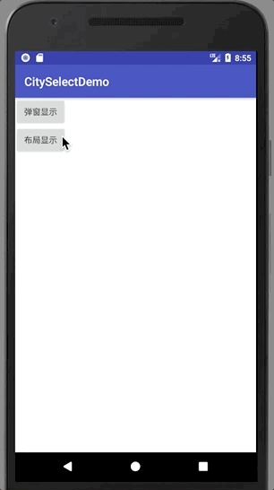

# CitySelectDemo
仿京东省市区三级联动
## 效果图



## 使用

```
compile 'com.cool:cityselect:1.0.0'
```


* 弹dialog的形式

```
new CitySelect(this)
                .setMainColor(Color.RED)
                .listener(new CitySelect.OnSelectListener() {
                    @Override
                    public void onSelect(String province, String city, String area) {
                        Log.e("399",province + "  " + city + "  " + area);
                        Toast.makeText(MainActivity.this,province + "  " + city + "  " + area,Toast.LENGTH_SHORT).show();
                    }
                }).dialog()
                .show();
```
* 布局中使用

```
if(mContainer.getChildCount() != 0){
            mContainer.removeAllViews();
        }
        CitySelect citySelect = new CitySelect(this)
                .setMainColor(Color.RED);
        citySelect.listener(new CitySelect.OnSelectListener() {
            @Override
            public void onSelect(String province, String city, String area) {
                Log.e("399",province + "  " + city + "  " + area);
                Toast.makeText(MainActivity.this,province + "  " + city + "  " + area,Toast.LENGTH_SHORT).show();
            }
        });
        mContainer.addView(citySelect.getView());
    }
```

## 如果需要导入自己的数据，调用此方法

```
setProvinceData(List<Province> provinces)
```

特别感谢 _有时丶提供[数据来源](http://blog.csdn.net/youshi520000/article/details/70808580)